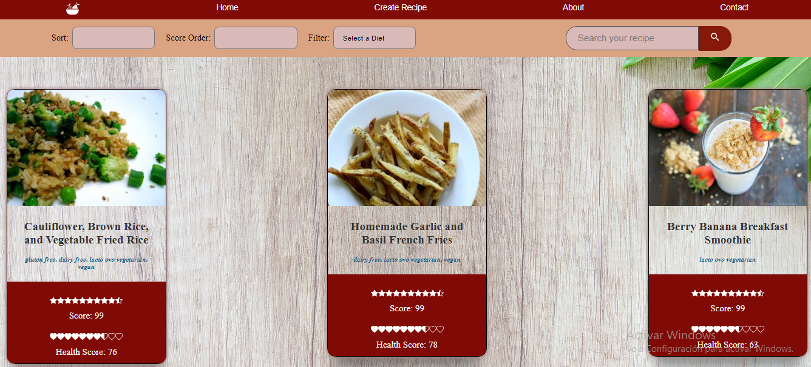
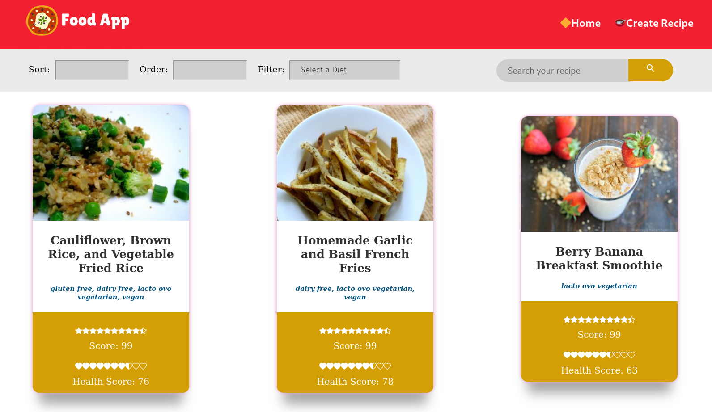
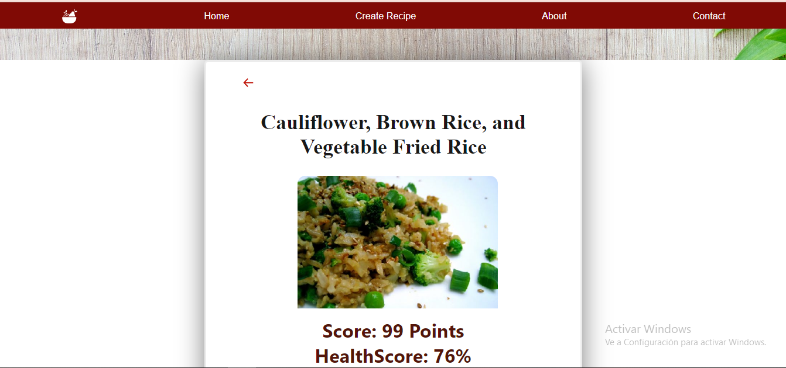
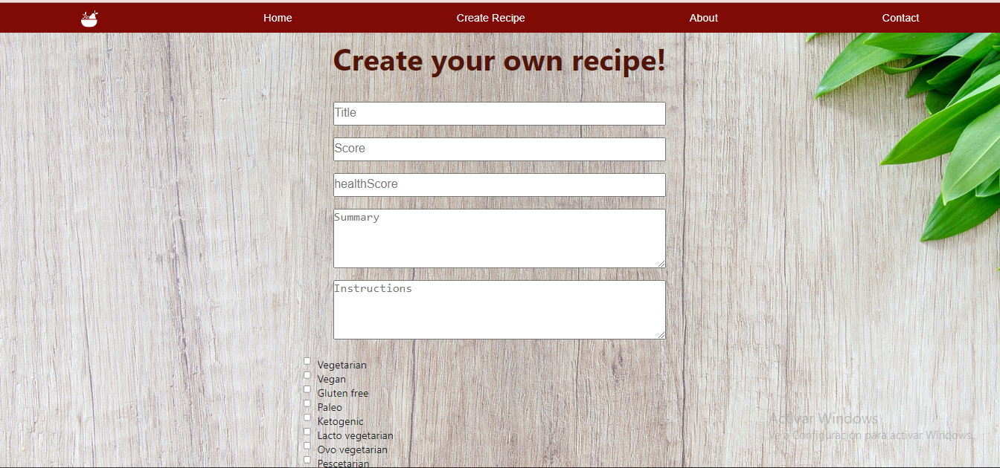

# App Food

## Search and Create your Recipes!
Aplicación a través de la cual se pueden ver distintas recetas de comida junto con información relevante de las mismas utilizando la api externa [spoonacular](https://spoonacular.com/food-api) y a partir de ella poder, entre otras cosas:

  - Buscar recetas
  - Filtrarlas / Ordenarlas
  - Crear nuevas recetas propias
#### Tecnologías utilizadas:
- [ ] React
- [ ] Redux
- [ ] Express
- [ ] Sequelize - Postgres

#### Frontend

El desarrollo del front-end contiene las siguientes rutas: 

__Pagina inicial__: landing page que contiene
- [ ] La imagen de fondo representativa al proyecto
- [ ] Botón para ingresar al home (`Ruta principal`)

__Ruta principal__: con
- [ ] Input de búsqueda para encontrar recetas por nombre
- [ ] Área donde se ve el listado de recetas y que nos muestra su:
  - Imagen
  - Nombre
  - Tipo de dieta (vegetariano, vegano, apto celíaco, etc)
- [ ] Botones/Opciones para filtrar por por tipo de dieta
- [ ] Botones/Opciones para ordenar tanto ascendentemente como descendentemente las recetas por orden alfabético y por puntuación
- [ ] Paginado para ir buscando y mostrando las siguientes recetas

__DATOS__: Dentro de la Ruta Principal se muestran tanto las recetas traidas desde la API como así también las de la base de datos.

__Ruta de detalle de receta__: contiene
- [ ] Los campos mostrados en la ruta principal para cada receta (imagen, nombre, tipo de plato y tipo de dieta)
- [ ] Resumen del plato
- [ ] Puntuación
- [ ] Nivel de "comida saludable"
- [ ] Paso a paso

__Ruta de creación de recetas__: contiene
- [ ] Un formulario __controlado__ con los siguientes campos
  - Nombre
  - Resumen del plato
  - Puntuación
  - Nivel de "comida saludable"
  - Paso a paso
- [ ] Posibilidad de seleccionar/agregar uno o más tipos de dietas
- [ ] Botón/Opción para crear una nueva receta

#### Base de datos

El modelo de la base de datos fue creado con las siguientes entidades:

- [ ] Receta con las siguientes propiedades:
  - ID: *
  - Nombre *
  - Resumen del plato *
  - Puntuación
  - Nivel de "comida saludable"
  - Paso a paso
- [ ] Tipo de dieta con las siguientes propiedades:
  - ID
  - Nombre

#### Backend

Fue desarollado con un servidor en Node/Express con las siguientes rutas:

- [ ] __GET /recipes?name="..."__:
  - Obtiene un listado de las primeras 9 recetas que contengan la palabra ingresada como query paraeter
  - Si no existe ninguna receta nos muestra un mensaje adecuado
- [ ] __GET /recipes/{idReceta}__:
  - Obtiene el detalle de una receta en particular
  - Trae solo los datos pedidos en la ruta de detalle de receta
  - Incluye los tipos de dieta asociados
- [ ] __GET /types__:
  - Obtiene todos los tipos de dieta posibles
  - En una primera instancia, cuando no exista ninguno, precarga en la base de datos con los tipos de datos indicados por spoonacular [acá](https://spoonacular.com/food-api/docs#Diets)
- [ ] __POST /recipe__:
  - Recibe los datos recolectados desde el formulario controlado de la ruta de creación de recetas por body
  - Crea una receta en la base de datos
